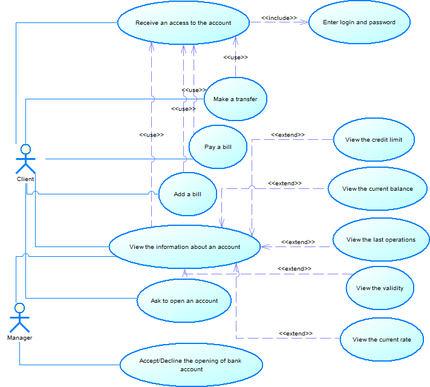
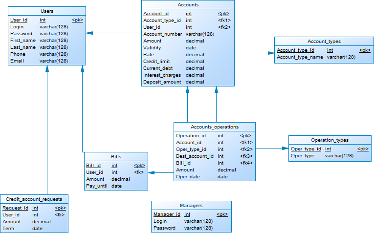
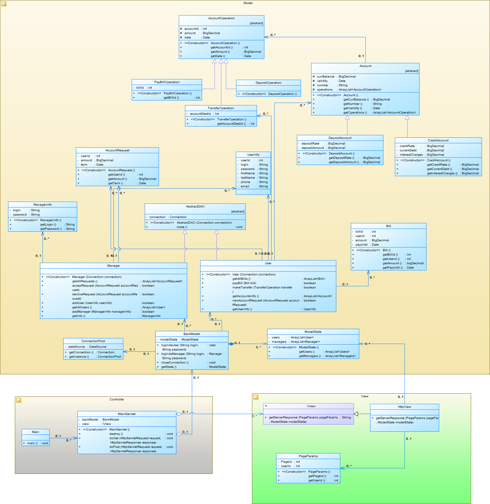

# JavaLabBank

## Опис завдання

*Варіант 18: Система "Банківські платежі"*

Клієнт банку може мати один або кілька банківських рахунків (депозитні, кредитні). Доступ до свого
рахунку клієнт отримує тільки після введення логіну і паролю. Також клієнт може здійснювати банківські перекази, оплачувати рахунки, виводити на екран загальну інформацію (балансу рахунку, останні операції, термін дії). Для кредитних рахунків також доступна інформація щодо кредитного ліміту, поточної заборгованості, суми нарахованих відсотків, кредитної ставки. Для депозитних рахунків - суму депозиту, ставку, історію поповнення. Клієнт може подати запит на відкриття кредитного рахунку, якщо такий відсутній. Менеджер банку підтверджує відкриття рахунку з урахуванням розміру депозиту і терміну дії.

## Use-case діаграма

	

## Схема бази даних

	

*Пояснення до таблиць:*
- Users - дані про клієнтів банку
- Managers - дані про облікові записи менеджерів банку
- Accounts - дані про рахунки клієнтів
- Account_types - дані про типи рахунків (кредитні, депозитні)
- Bills - дані про рахунки для оплати клієнтами
- Accounts_operations - дані про операції з рахунками
- Operation_types - дані про типи операцій (перекази, оплата рахунків, нарахування депозитних відсотків)
- Credit_account_requests - дані про запити клієнтів щодо відкриття кредитних рахунків

## Діаграма класів

	

Застосунок реалізовано відповідно до архітектурного шаблону MVC.

*Класи моделі:*

Інтерфейсом моделі є класс BankModel, який надає методи для входу в систему, а також для отримання її стану (ModelState), що необхідно для генерації JSP-сторінок у View. Методи для виконання операцій клієнтів банку надаються у класі User, операцій менеджеру банку - у класі Manager. Об'єкти цих класів являють собою реалізацію DAO, які виконують операції з базою данних за допомогою з'єднань (Connections) з базою даних, які отримуються із пулу з'єднань. Пул реалізовано у класі ConnectionPool, що являє собою клас-одиночку (Singleton).
Класи User та Manager оперують класами, які відповідають деяким таблицям з бази даних. Такі класи (Bill, AccountRequest, UserInfo, ManagerInfo) слугують для комплексного збереження та передачі інформації при виконанні різних запитів.
Об'єкти більш складної структури об'єднано у ієрархії. Ієрархія банківських операцій (AccountOperation) містить операцію оплати рахунку (PayBillOperation), операцію здійснення переказу (TransferOperation) та оперцію нарахування відсотків за депозит (DepositOperation). *Зауваження:* У ході проектування ієрархії банківських операцій не було використано шаблонів проектування фабрик, оскільки деякі з операцій містять унікальні атрибути, а також створюються у деяких випадках окремо.
Також у ієрархію об'єднано класи, що вібповідають за банківські рахунки (DepositAccount та CreditAccount).

*Класи контролера:*

Клас MainServlet описує сервлет застосунку. Він опрацьовує запити, що надходять до системи, викликає відповідні методи моделі, а також робить запит до View, яка надає відповідну JSP-сторінку. Клас Main є точкою входу у застосунок: створює та ініціалізує усі основні класи системи.

*Класи представлення:*

Інтерфейс IView описує універсальне представлення, яке за отриманим станом моделі (ModelState) та параметрами поточної сторінки (PageParams) генерує відповідь сервера у вигляді рядка. Реалізація HttpView реалізує http-представлення, що генерує необхідні дані у форматі JSP-сторінок.

